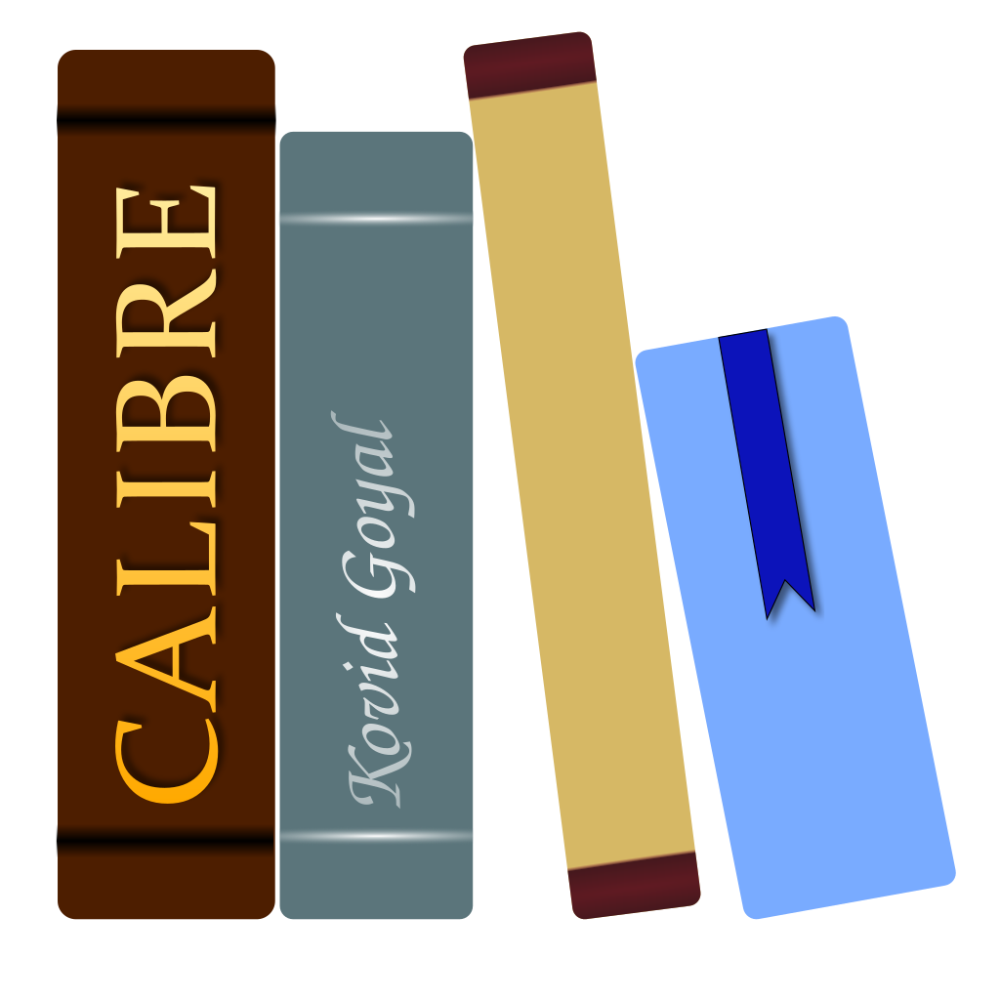
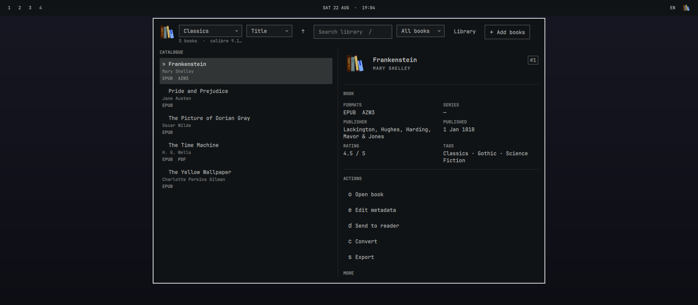

<p align="center">
  
</p>

<h1 align="center">Calibre for Omarchy</h1>

<p align="center">Manage your ebook library from the Omarchy Quattro bar.</p>

<p align="center">
  <a href="https://github.com/WhiteHades/omarchy-calibre-plugin/releases"></a>
  <a href="LICENSE"></a>
  
  
</p>



Calibre for Omarchy puts the everyday parts of Calibre in a native, keyboard-friendly panel. Browse, search, edit, convert, import, export, and send books to a connected reader without opening the Calibre desktop.

## Features

- Search, sort, and filter local Calibre libraries.
- Add files or folders and edit common metadata and covers.
- Fetch metadata with Calibre's configured providers.
- Open the best available format in your default reader.
- Convert with Calibre defaults or reveal format-specific options.
- Add, replace, remove, and export formats.
- Send books to a connected reader and eject it safely.
- Review destructive changes before they run.
- Track and cancel work from a native jobs view.

## Requirements

- Omarchy Quattro
- Calibre 7 or newer on `PATH`

The plugin does not bundle Calibre. If Calibre is missing, the setup screen can start Omarchy's Calibre installer or open the official Linux download page. Installation only starts after you choose an action.

## Install

```bash
omarchy plugin add https://github.com/WhiteHades/omarchy-calibre-plugin.git --enable
```

The Calibre icon appears in the right side of the bar. Select it to open the panel. The plugin first checks remembered libraries and `~/Calibre Library`; use **Add another library** when your library is elsewhere.

## Keyboard

| Key | Action |
| --- | --- |
| `h` `j` `k` `l` or arrow keys | Move between panes and books |
| `Enter` or `Space` | Run the selected action |
| `/` | Search |
| `o` | Open book |
| `e` | Edit metadata |
| `d` | Send to reader |
| `c` | Convert |
| `s` | Export |
| `f` | Manage formats |
| `x` or `Delete` | Remove from library |
| `p` or `:` | Command palette |
| `?` | Help and diagnostics |
| `r` | Refresh |
| `Esc` | Close the current view or panel |

## Safety and limits

The plugin sends library changes through Calibre's public command-line tools. It does not write to `metadata.db` or launch the Calibre desktop. Replacement and removal flows bind confirmation to the selected book, file, reader, or export target and reject stale plans.

Version 0.1 manages local libraries only. Book opening uses the system default application. Reader transfer uses Calibre's direct `ebook-device` interface, so Calibre GUI save templates and device-specific cover sidecars might not apply. Some Calibre commands do not expose numeric progress; those jobs show activity until Calibre finishes.

Plugins run without a sandbox. Review the source before installation, as you would for any Omarchy plugin.

## Update or remove

```bash
omarchy plugin update io.github.whitehades.calibre --yes
omarchy plugin remove io.github.whitehades.calibre
```

## Development

```bash
omarchy plugin validate .
python3 -m unittest discover -s tests -p 'test_*.py'
node tests/model-test.js
tests/qml-lint-test.sh
tests/qml-compile-test.sh
tests/qml-workflow-test.sh
tests/qml-bridge-test.sh
```

See [CONTRIBUTING.md](CONTRIBUTING.md) for the full local setup and test policy.

## License

The plugin code and documentation use the [MIT license](LICENSE). The exact Calibre logo at [`assets/calibre.svg`](assets/calibre.svg) is a separate GPL-3.0-only asset; see [`assets/NOTICE.md`](assets/NOTICE.md).
